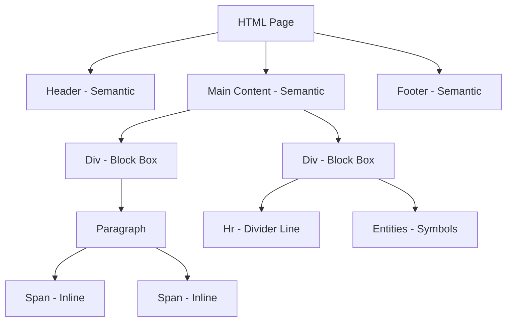

<div align="center">

<!-- Animated Header -->


<!-- Typing SVG -->


<!-- Badges -->
<p align="center">
  
  
  
  
</p>

<!-- Skill Icons -->
<p align="center">
  
</p>


</div>

# 📘 HTML Level 2 — The Architect's Blueprint

## 🎯 Goal
The goal of this module is to move beyond simple text and learn how to **structure** a webpage. You will learn how to group elements together, use invisible boxes to organize your site, and use "smart tags" that help search engines understand what your website is about.

---

## 🧠 1. Simple Explanation (Like explaining to a child)

Imagine you are playing with **LEGO bricks**. 
- Some bricks are huge and long; they take up the whole floor space from left to right (**Block Elements**). 
- Some bricks are tiny; you can put many of them in one single line (**Inline Elements**).

In HTML Level 2, we learn how to use these "bricks" to build a house (a website). We use big boxes called `<div>` to make rooms, and tiny labels called `<span>` to mark specific things. We also learn the "secret codes" (Entities) to show symbols like © or ❤️ that aren't on your keyboard!

---

## 🌍 2. Real Life Example

### 1. The Chocolate Box (Div vs Span)
Imagine a big box of chocolates. 
- The **Big Box** itself is like a `<div>`. It holds everything together.
- The **Individual Wrapper** around one chocolate is like a `<span>`. It only covers that specific piece.

### 2. The Newspaper (Semantic Markup)
When you look at a newspaper, you instantly see the **Headline**, the **Article**, and the **Footer** at the bottom. 
- **Non-Semantic:** If every part of the paper looked exactly the same, you'd be confused.
- **Semantic:** Giving parts names like `<header>` or `<footer>` is like the newspaper having clear sections so you know exactly where the sports news is!

---

## 💻 3. Code Example (Basic Structures)

```html
<!-- Block vs Inline & Layout Basics -->
<div>
  <h1>Welcome to My Toy Shop</h1>
  <p>We sell <span>Magic</span> wands and <span>Flying</span> capes.</p>
  <hr>
  <p>Water Formula: H<sub>2</sub>O | Math: 10<sup>2</sup> = 100</p>
</div>
```

### 🔍 Line-by-Line Analysis
1.  `<div>`: This is our "Parent Container." It creates a big invisible box around everything.
2.  `<h1>`: A **Block element**. It pushes the next line down.
3.  `<span>`: An **Inline element**. It stays inside the paragraph text to highlight specific words without breaking the line.
4.  `<hr>`: A horizontal rule. It draws a line across the screen to separate topics.
5.  `<sub>`: Subscript. It drops the "2" slightly lower (used in chemistry).
6.  `<sup>`: Superscript. It raises the "2" slightly higher (used in math).

---

## ⚙️ 4. Code Example (Practical Use: Semantic Web)

> [!TIP]
> Always use Semantic Tags! They don't change how the site looks, but they make your site "SEO Friendly" (Google loves them).

```html
<header>
  <nav>Home | About | Shop</nav>
</header>

<main>
  <article>
    <h2>The Legend of Coding</h2>
    <p>Once upon a time, there was a &lt;coder&gt;...</p>
  </article>
</main>

<footer>
  <p>&copy; 2023 My Awesome Website</p>
</footer>
```

**How it solves the problem:**
Instead of using `<div>` for everything, we use `<header>`, `<main>`, and `<footer>`. This tells the browser exactly which part is the menu, which is the main content, and which is the bottom info. Note the `&lt;` and `&gt;` (Entities) used to show the `< >` brackets as text!

---

## 🧩 5. Mental Model
### The "Box-in-a-Box" Strategy
Think of your website as a **Delivery Truck**.

1.  **Input:** Your raw content (text, images).
2.  **Process (HTML Layout):** 
    - You put content into small bags (`<span>`).
    - You put bags into medium boxes (`<p>`, `<li>`).
    - You put boxes into large shipping containers (`<div>`, `<section>`).
3.  **Output:** A perfectly organized truck where nothing is rolling around loosely!

---

## 📊 6. Visual Thinking



---

## 🧪 7. Practice Problems

### Easy (🚀)
1. Create a page with your name as `<h1>` and a horizontal line `<hr>` below it.
2. Write the chemical formula for Glucose ($C_6H_{12}O_6$) using `<sub>` tags.
3. Write "5 squared is 25" using the `<sup>` tag.

### Medium (🏗️)
1. Create a `<div>` with a background color (use inline style) and put three `<span>` tags inside it. Do they appear on the same line or different lines?
2. Use HTML Entities to display this sentence: "I love coding & it costs < $100 to start! ©"

### Challenge (🔥)
1. Build a Mini-Blog structure using only Semantic tags: `<header>`, `<nav>`, `<main>`, `<article>`, `<aside>`, and `<footer>`. Inside the article, use Emmet shortcuts to generate 5 paragraphs quickly.

---

## ❌ 8. Common Mistakes

1.  **Putting Block inside Inline:** Never put a `<div>` inside a `<span>`. It’s like trying to put a giant fridge inside a small lunchbox!
2.  **Using `<br>` for spacing:** Beginners use `<br><br><br>` to create space. **Don't!** Use `<hr>` for separation or CSS for spacing.
3.  **Forgetting Entities:** If you type `<` directly in your text, the browser might think you are starting a new HTML tag and break your site. Always use `&lt;`.

---

## ✅ 9. Summary

-   **Block vs Inline:** Block takes the whole width; Inline only takes what it needs.
-   **Div & Span:** Div is for grouping large sections; Span is for small text parts.
-   **Semantic Tags:** Tags like `<header>` and `<footer>` give meaning to your code.
-   **Entities:** Special codes (like `&copy;`) for symbols that aren't on the keyboard.
-   **Emmet:** A fast way to type code (e.g., typing `div>p*3` and hitting Tab).

---

## 🚀 10. Next Step
Now that you can build the **structure** of a house, it's time to **paint it!** Your next journey is **CSS (Level 1)**, where we will learn how to add colors, fonts, and beautiful designs to these boxes.

<div align="center">

<b>Keep Coding, Keep Building! 🌟</b>
</div>
