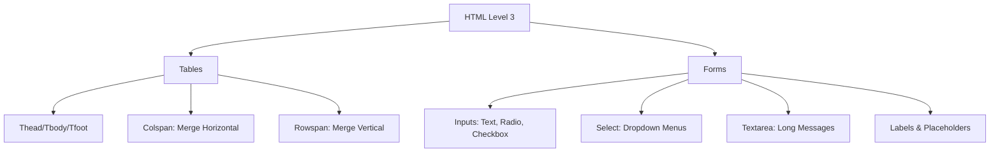

<div align="center">
  

  

  <p>
    
    
    
    
  </p>

  
</div>


# 📘 HTML Level 3 — Tables & Forms (The Ultimate Beginner Guide)

## 🎯 Goal
In this level, we learn how to **organize data** neatly using Tables and how to **talk to our users** by creating Forms (where they can type, click, and select options).

---

## 🧠 1. Simple Explanation (Like You're 5)

Imagine you have a big box of LEGOs. 
1. **Tables**: These are like a **shelf** where you put your toys in neat rows and columns so you can find them easily. 
2. **Forms**: This is like a **letter** you write to a friend. You leave blank spaces for them to write their name, pick their favorite color, or check a box if they want to play.

> [!TIP]
> **Tables** = Organizing Data.
> **Forms** = Collecting Data.

---

## 🌍 2. Real Life Examples

### 📅 The School Timetable (Table)
Think of your school schedule. You have **Days** (Rows) and **Periods** (Columns). At the intersection of "Monday" and "Period 1," you find "Maths." That's exactly how an HTML table works!

### 📝 The Pizza Order Form (Form)
When you order pizza online, you:
*   Type your **Name** (Input).
*   Choose **Size** (Radio Button).
*   Select **Toppings** (Checkboxes).
*   Write **Special Instructions** (Text Area).
*   Click **Order Now** (Button).

---

## 💻 3. Code Example (The Basic Table)

```html
<table border="1">
  <thead>
    <tr>
      <th>Fruit</th>
      <th>Color</th>
    </tr>
  </thead>
  <tbody>
    <tr>
      <td>Apple</td>
      <td>Red</td>
    </tr>
  </tbody>
</table>
```

### 🔍 Line-by-Line Analysis
1.  `<table>`: This opens our "shelf."
2.  `<thead>`: The "Head" section for titles.
3.  `<tr>`: A "Table Row." Everything inside stays on one horizontal line.
4.  `<th>`: "Table Header." It makes text **bold** and centered (The title of the column).
5.  `<tbody>`: The "Body" where the actual information lives.
6.  `<td>`: "Table Data." This is a single cell/box in our shelf.

**Expected Output:**
| Fruit | Color |
| :--- | :--- |
| Apple | Red |

---

## ⚙️ 4. Code Example (The Super Form)

This code shows how we collect user information:

```html
<form>
  <label for="username">Name:</label>
  <input type="text" id="username" name="user_name" placeholder="Enter your name">
  
  <p>Choose your favorite snack:</p>
  <input type="radio" id="chips" name="snack" value="chips">
  <label for="chips">Chips</label>
  
  <input type="checkbox" id="subscribe" name="sub">
  <label for="subscribe">Subscribe to Newsletter</label>
  
  <button type="submit">Submit Me!</button>
</form>
```

### 🔍 Practical Breakdown
*   **Label**: Tells the user what to do ("Type your name here").
*   **Input (type="text")**: A small box for typing text.
*   **Placeholder**: The faint text inside the box that disappears when you type.
*   **Name Attribute**: The "ID Tag" that the computer uses to remember what the user typed.
*   **Radio**: You can only pick **ONE** (Like choosing one path).
*   **Checkbox**: You can pick **MANY** (Like choosing toppings).

---

## 🧩 5. Mental Model (Input → Process → Output)

Imagine a **Vending Machine**:

1.  **Input**: You press buttons (Form Inputs) and put in coins.
2.  **Process**: The machine checks what you pressed and if you have enough money.
3.  **Output**: It drops your snacks (The result/submission).

> [!IMPORTANT]
> Without the `name` attribute in your inputs, the server is like a waiter who forgets which customer ordered which dish!

---

## 📊 6. Visual Thinking (Mermaid Diagram)



---

## 🧪 7. Practice Problems

### 🟢 Easy
1. Create a table with 3 rows and 2 columns showing your favorite movies and their ratings.
2. Create a form with just a Name input and a Submit button.
3. Add a `placeholder` to an input that says "Type your secret here..."

### 🟡 Medium
1. Create a table where one cell spans **2 columns** using `colspan`.
2. Create a "Sign Up" form with a Name field, a Password field, and a "Gender" radio button group.

### 🔴 Challenge
1. Build a "Pizza Feedback Form" that includes:
   - A `select` dropdown for Pizza Size.
   - A `range` slider for "How hungry are you?".
   - A `textarea` for "Complaints".
   - Use `label` for every single input.

---

## ❌ 8. Common Mistakes

1.  **Missing `name` attribute**: Beginners forget `name="something"`. Without this, the data won't be sent to the server!
2.  **Forgetting Labels**: Writing text next to an input without a `<label>` tag. Labels make it easier for people (and screen readers) to click the input.
3.  **Mixing up Colspan & Rowspan**: 
    - `colspan` = Merging columns (Left to Right).
    - `rowspan` = Merging rows (Top to Bottom).

---

## ✅ 9. Summary
*   **Tables** use `tr` for rows and `td` for data.
*   **Semantics** (`thead`, `tbody`) make your code professional and readable.
*   **Forms** are the primary way to get data from users.
*   **Input types** change the behavior (e.g., `checkbox` vs `radio`).
*   **Labels** connect text to inputs using the `for` and `id` attributes.

---

## 🚀 10. Next Step
Now that you can organize data and collect it, it's time to learn **CSS (Level 1)** to make these boring white tables and forms look beautiful and colorful!


<div align="center">
  <sub>Built with ❤️ by the Master Documentation Architect</sub>
</div>
