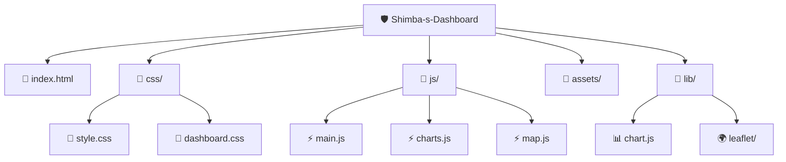

markdown code6. HTML (Level 3)

Tables in HTML

Semantics in Tables
Nidoc

Colspan & Rowspan Attributes

Practice Qs

Forms in HTML
Nidoc

Input - Form Element

video

Placeholders & Labels
vidpo

Button Element

vide

Name Attribute
Nideo

Practice Qs
video

Checkbox - Input Element
videa

Radio - Input Element
Nideo

Select - Input Element
videa

Range - Input Element
vidpo

Text Area
Mujhe { 6. HTML (Level 3)

Tables in HTML

Semantics in Tables
Nidoc

Colspan & Rowspan Attributes

Practice Qs

Forms in HTML
Nidoc

Input - Form Element

video

Placeholders & Labels
vidpo

Button Element

vide

Name Attribute
Nideo

Practice Qs
video

Checkbox - Input Element
videa

Radio - Input Element
Nideo

Select - Input Element
videa

Range - Input Element
vidpo

Text Area} ko bilkul beginner level par samjhao, jaise ek chhote bachhe ko samjha rahe ho. Explanation simple, clear aur step-by-step ho.
aue mermaid se visual bhi dena yese example ```mermaid
graph TD
    A[🛡️ INCOMING THREAT] --> B{🔍 Analyze Severity}

    B -->|Score 9-10| C[🔴 CRITICAL]
    B -->|Score 6-8| D[🟠 HIGH]
    B -->|Score 3-5| E[🟡 MEDIUM]
    B -->|Score 1-2| F[🟢 LOW]

    C --> C1[🚨 Immediate Alert]
    C --> C2[🔒 Auto Block IP]
    C --> C3[📋 Log Incident]

    D --> D1[⚠️ Warning Notification]
    D --> D2[📋 Log & Monitor]

    E --> E1[📝 Log for Review]
    E --> E2[👁️ Add to Watchlist]

    F --> F1[📊 Stats Update Only]

    C1 --> G[📊 Dashboard Update]
    D1 --> G
    E1 --> G
    F1 --> G
```

---

## 🔍 Technical Deep-Dive

### 📂 Directory Structure

Output pure markdown format mein do aur content ko README.md style mein structure karo.

Structure strictly follow karo:

# 📘 {TOPIC_NAME} — Beginner Friendly Guide

## 🎯 Goal
Is topic ka simple objective kya hai, 2-3 lines mein batao.

## 🧠 1. Simple Explanation (Bachhe Jaise Samjho)
- Bilkul basic language use karo
- Difficult words avoid karo
- Short sentences use karo
- Real meaning samjhao

## 🌍 2. Real Life Example
- 2-3 daily life examples do
- Har example ko clearly explain karo

## 💻 3. Code Example (Basic)
- Ek simple beginner code example do
- Code block ke andar likho
- Fir line-by-line explanation karo
- Output bhi batao

## ⚙️ 4. Code Example (Practical Use)
- Real-world problem lo
- Uska solution code se dikhao
- Explain karo kaise solve hua

## 🧩 5. Mental Model
- Concept ko imagine karne ka tarika batao
- Analogy use karo (machine, box, water flow, traffic signal, etc.)
- Input → Process → Output format use karo

## 📊 6. Visual Thinking
Text diagram bana kar concept flow samjhao

## 🧪 7. Practice Problems
### Easy (3)
### Medium (2)
### Challenge (1)

## ❌ 8. Common Mistakes
- 3 common beginner mistakes
- Har mistake ka reason batao

## ✅ 9. Summary
- 5 bullet points mein quick revision

## 🚀 10. Next Step
- Is topic ke baad kya seekhna chahiye

Important:
- Content detailed ho
- Markdown properly formatted ho
- Headings clear ho
- Code properly formatted ho
- Output beginner-friendly ho
er-friendly ho
